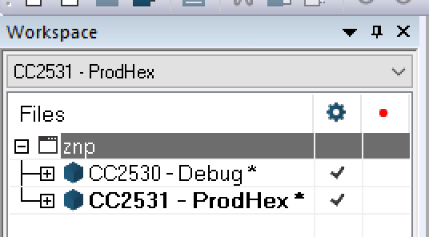

# Compiling the firmware

## Setup development environment
1. Download and install [Z-STACK-HOME 1.2.2a](http://www.ti.com/tool/z-stack-archive).
2. Download and install [IAR Embedded Workbench for 8051](https://www.iar.com/iar-embedded-workbench/#!?architecture=8051).

*NOTE: For IAR Embedded Workbench for 8051 you need either the full (paid) version or the 30-days evaluation version.*

## Compiling
1. Copy `firmware.patch` to `Z-Stack Home 1.2.2a.44539`
2. Open Git Bash, go to `Z-Stack Home 1.2.2a.44539` and apply the patch using `git apply firmware.patch`.
3. Open `Z-Stack Home 1.2.2a.44539\Projects\zstack\ZNP\CC253x\znp.eww` with IAR Embedded workbench for 8051.
4. You will get a warning: *The project file 'CC253(0/1).ewp' is in an old format. Would you like to convert it for use with this version?*. Press **yes** for both.
5. Select the correct target:
  - For CC2531 select *CC2531 - X*
  - For CC2530 or CC2530_CC2591 select *CC2530 - X*
  - Depending if you want to compile the `.hex` or SBL firmware select *- ProdHex* or *- ProdSBL*



6. Right-click on your target and press options. Go to C/C++ compiler -> preprocessor. Depending on what you want to compile, add the following symbols to *Defined symbols*:
- Device type: `FIRMWARE_CC2530`, `FIRMWARE_CC2530_CC2531` or `FIRMWARE_CC2531`.
- Firmware type: `FIRMWARE_DEFAULT`, `FIRMWARE_MAX_STABILITY` or `FIRMWARE_MAX_DEVICES`.
- In case you want to compile the SBL firmware, also add `FIRMWARE_SBL`.

To compile e.g the default CC2531 firmware, use:
```c
FIRMWARE_CC2531
FIRMWARE_DEFAULT
```

*NOTE: `FIRMWARE_MAX_DEVICES` is only available in combination with `FIRMWARE_CC2531`.*

7. Press OK.
8. Right-click on your target and click *Rebuild all*.
9. Once finished, you can find the `CC253(0|1)ZNP-Prod.(hex|bin)` file in `Z-Stack Home 1.2.2a.44539\Projects\zstack\ZNP\CC253x\dev`.
